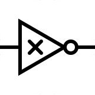

## Logix



Online Open-Source Logic Circuit Simulator  
Use a remotely hosted instance here: [Logix](http://darktree.net/projects/logic/menu.php)

### To start locally
```bash
git clone https://github.com/magistermaks/net-logix
cd net-logix
php -S localhost:8080
```

And then open `localhost:8080/index.php` in web browser.

## License
This software is licensed under GNU GPL 2.0, see [LICENSE](./LICENSE) for more details.
